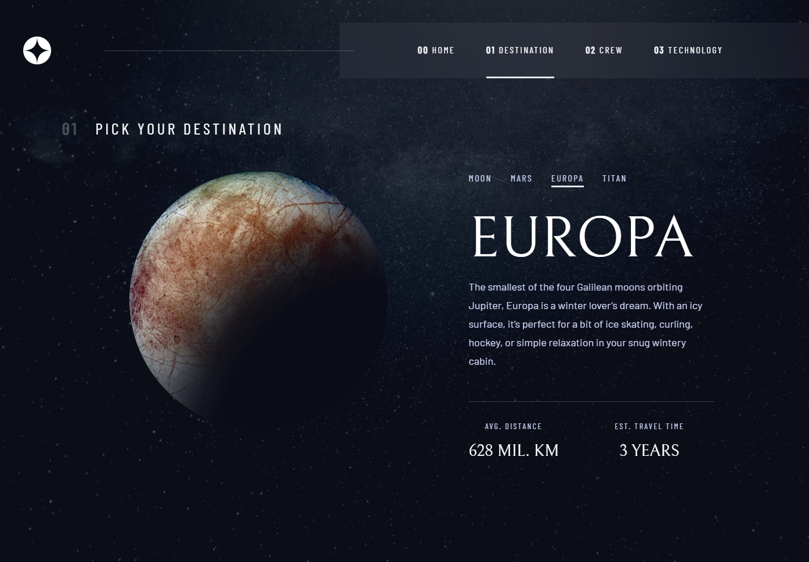

# Frontend Mentor - Space tourism

This is a solution to the [Space tourism multi-page website challenge on Frontend Mentor](https://www.frontendmentor.io/challenges/space-tourism-multipage-website-gRWj1URZ3). Frontend Mentor challenges help you improve your coding skills by building realistic projects. 

## Overview

### The challenge

Users should be able to:

- View the optimal layout for each page depending on their device's screen size
- See hover states for all interactive elements throughout the site

### Screenshot

### Built with

Technologies:

Next.js, TailwindCSS, Framer Motion, Typescript
